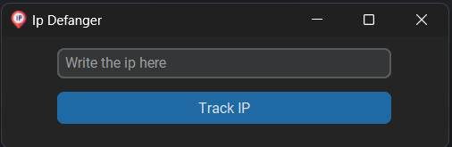
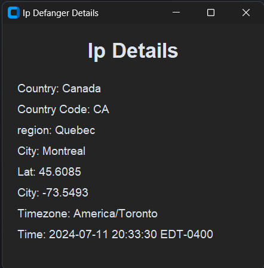

<div align="center">

<p style="font-size:30px;font-weight:bold;">Ip Defanger</p>
</div>
This project allows you to defang some ip informations, using ip-api.com, it was created with CustomTkinter and: 

<div align="center">


</div>
<hr>

### The Project Preview
<div align="center">
    
    
</div>

### How to run

```bash
# Clone the project repository
git clone https://github.com/angelo-francisco/Ip-Defanger.git

# Acess the venv(can be diff. in other OS)
./venv/Scripts/Activate

# Run the project
python cd/main.py
```

## License 🔑

The license of the project is [MIT](https://opensource.org/license/mit)

<hr>
Made by Ângelo Francisco 🖖.